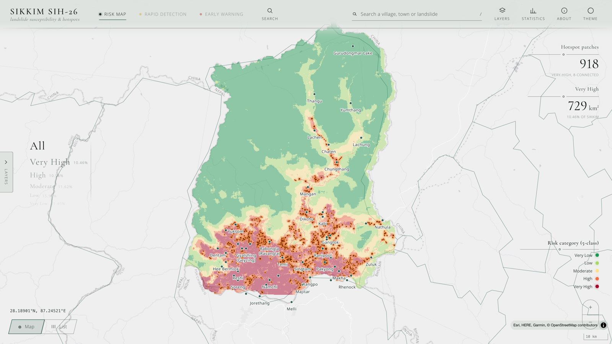
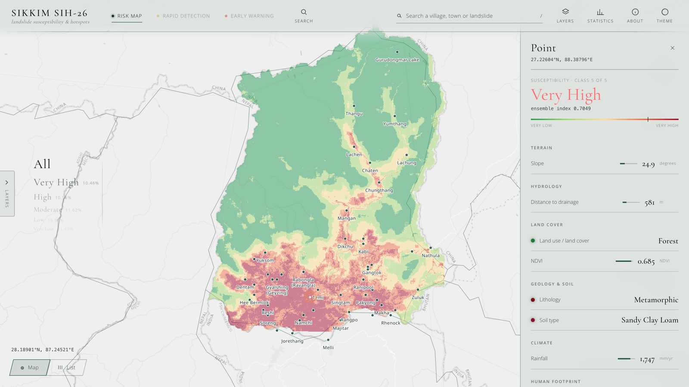
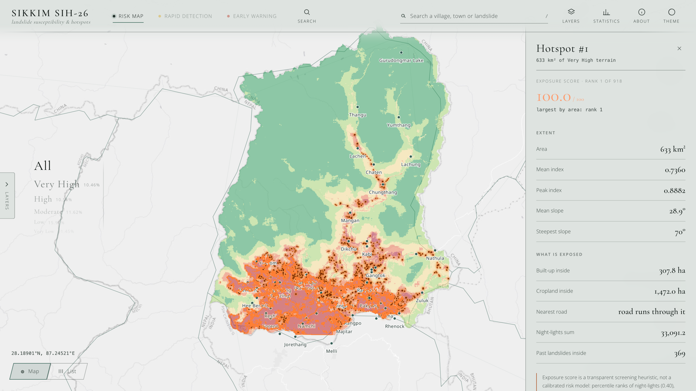
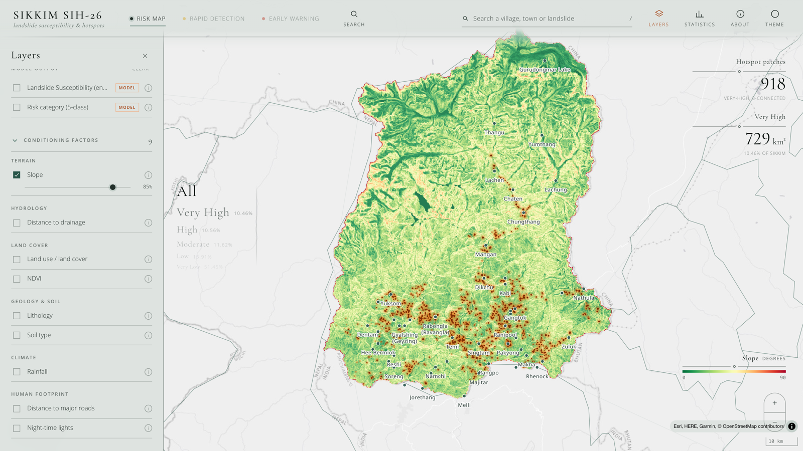
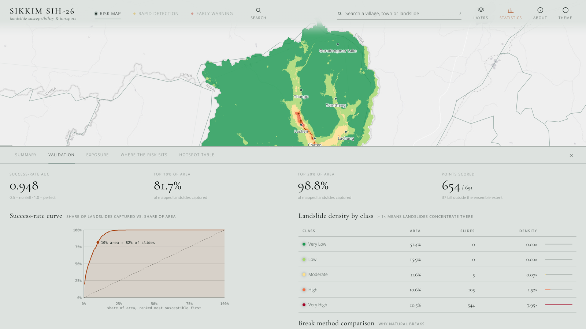
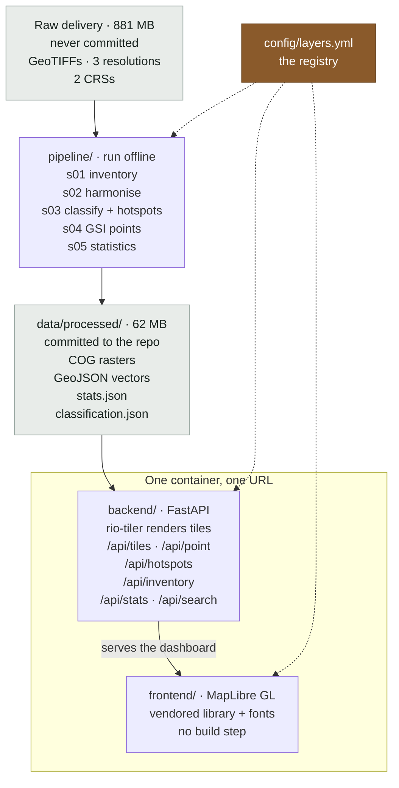
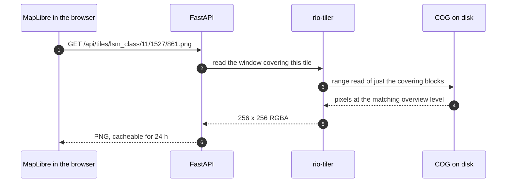
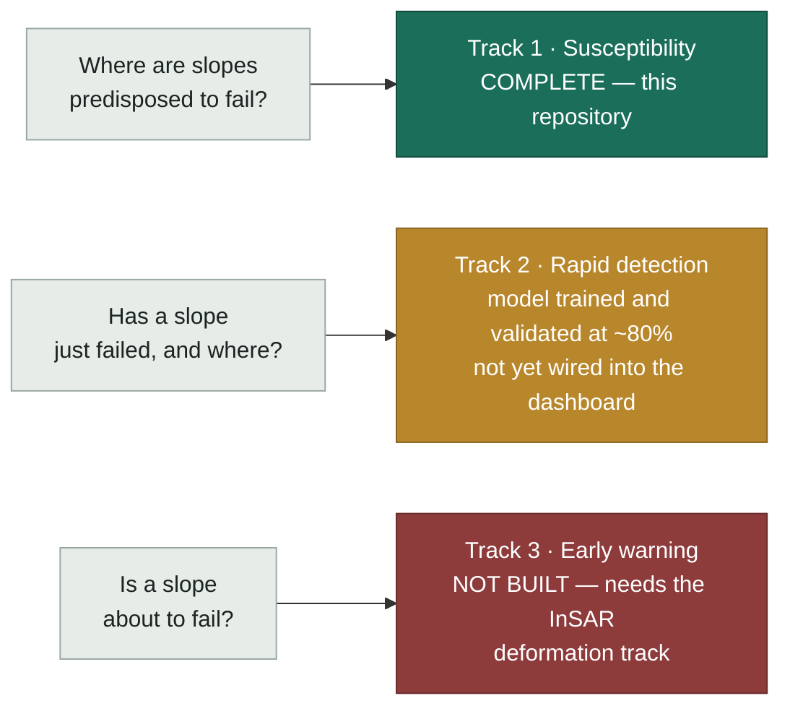

# Sikkim Landslide Risk Platform

An interactive GIS platform for landslide susceptibility mapping, hotspot identification and
exposure screening across Sikkim, India.

[](https://sikkim-landslide.onrender.com/)
[](https://sikkim-landslide.onrender.com/api/docs)

[](LICENSE)

### Live demo — **https://sikkim-landslide.onrender.com/**




---

## Contents

[1. Project information](#1-project-information) ·
[2. Problem](#2-problem-description) ·
[3. Solution approach](#3-solution-approach) ·
[4. Core capabilities](#4-core-capabilities) ·
[5. Tech requirements](#5-tech-requirements) ·
[6. System architecture](#6-system-architecture) ·
[7. Installation](#7-installation) ·
[8. Execution](#8-execution) ·
[9. Results](#9-results) ·
[10. Scope](#10-scope--what-this-is-and-what-it-is-not) ·
[11. Future enhancements](#11-future-enhancements) ·
[12. Repository layout](#12-repository-layout) ·
[13. Submission materials](#13-submission-materials) ·
[14. Credits](#14-credits) ·
[15. License](#15-license)

---

## 1. Project Information

| | |
|---|---|
| **Project title** | Sikkim Landslide Risk Platform |
| **Problem Statement ID** | 26001 |
| **Problem Statement** | AI-Based Early Warning and Landslide Risk Monitoring System in NER |
| **Organisation** | Ministry of Development of North Eastern Region (MDoNER) |
| **Category** | Software |
| **Theme** | Disaster Management · GIS and Remote Sensing |
| **Study area** | Sikkim, India — 7,108 km² |
| **Live deployment** | https://sikkim-landslide.onrender.com/ |

---

## 2. Problem Description

Sikkim is one of the most landslide-prone states in India. Steep Himalayan slopes, intense monsoon
rainfall and rapid hill-road construction combine to produce slope failures that cut highways,
isolate villages and cost lives. Of the 691 landslides in the Geological Survey of India's
inventory for the state, **638 were rainfall-triggered**.

Planning and mitigation need an answer to a specific question: **which slopes are predisposed to
fail, and what sits on them?** That answer exists today only as static PDF maps and scattered
raster files — there is no shared, queryable view that a district officer can open, click and
interrogate.

This project answers that question. It does **not** claim to be an early-warning system; see
section 10.

---

## 3. Solution Approach

A five-model machine-learning ensemble produces a continuous susceptibility surface over 17
conditioning factors. The platform turns that surface into decisions:

```mermaid
flowchart LR
    F["17 conditioning factors<br/>slope · NDVI · rainfall<br/>lithology · soil · LULC<br/>roads · drainage · NTL"]
    M["5 ML models<br/>CNN · Random Forest<br/>tabular · chained<br/>equal weight, 0.2 each"]
    S["Susceptibility index<br/>continuous<br/>0 to 0.89"]
    J["Jenks natural breaks<br/>k = 5<br/>breaks written to<br/>classification.json"]
    C["5 risk categories<br/>Very Low to<br/>Very High"]
    H["918 hotspot patches<br/>class 5, sieved at 1.08 ha<br/>8-connected · polygonised<br/>per-patch zonal stats"]
    X["Exposure ranking<br/>night-lights · built-up<br/>road proximity<br/>patch size"]

    F --> M --> S --> J --> C --> H --> X

    classDef ml fill:#8a5a2b,stroke:#6b451f,color:#ffffff
    classDef det fill:#1b6f5a,stroke:#124b3d,color:#ffffff
    classDef dat fill:#e8ece9,stroke:#9aa8a2,color:#1a2420

    class M ml
    class J,C,H,X det
    class F,S dat
```



<sub>Brown is the upstream ML step. Green is deterministic, re-runnable and checkable here.</sub>

**Hotspot extraction is deterministic and auditable** — there is no second model. Class 5
("Very High") is sieved at a 1.08 ha floor, labelled into 8-connected components, polygonised, and
given per-patch zonal statistics. Every break value and parameter is written to
`data/processed/classification.json`, so the classification can be checked rather than taken on
trust.

Each hotspot carries an **exposure score** — a transparent screening heuristic over night-lights,
built-up area, road proximity and patch size — so 918 patches can be ranked by what is actually at
stake rather than by area alone.

---

## 4. Core Capabilities

### Click anywhere to inspect

Every conditioning factor that fed the model, read back at the pixel you clicked, alongside the
model's verdict for it. Slope, drainage distance, land cover, NDVI, lithology, soil, rainfall and
the human-footprint layers — the evidence behind the colour, not just the colour.




it carries its extent, its susceptibility statistics, its terrain, and an itemised
account of what sits inside it — built-up hectares, cropland, road proximity, night-lights total,
and the count of past landslides mapped within the patch.




### Nine conditioning factors as toggleable layers

Each with its own legend, opacity control and provenance note, so the surface can be read against
any single factor that produced it.



### Statistics panel

Area by class, validation against the GSI inventory, exposure totals, and cross-tabulations of risk
against land cover, lithology, soil and slope band.



### Also

- **Risk map** — five susceptibility categories over Sikkim, filterable by class, served as tiles
  rendered on demand.
- **Search** across settlements, hotspots and inventory landslides.
- **Past-landslide inventory** — 691 GSI records, filterable.
- **REST API** — every view in the dashboard is backed by a documented endpoint.

---

## 5. Tech Requirements

| Layer | Technology |
|---|---|
| **Frontend** | HTML, CSS, vanilla ES modules, MapLibre GL JS (vendored — no build step) |
| **Backend** | Python 3.12, FastAPI, Uvicorn |
| **Geospatial** | rasterio, rio-tiler, Shapely, pyproj, GDAL (Cloud-Optimised GeoTIFF) |
| **Processing** | NumPy, SciPy |
| **ML (upstream)** | CNN, Random Forest and tabular models — equal-weight ensemble |
| **Data formats** | COG rasters, GeoJSON vectors, JSON statistics |
| **Testing** | pytest |
| **Deployment** | Docker, Google Cloud Run / Render, GitHub Actions CI |

No database is required: the processed rasters and vectors are the data store, which is what keeps
the platform clone-and-run.

---

## 6. System Architecture



**One container serves both the API and the dashboard**, so a deployment is a single image and a
single URL.

The whole system is driven by one registry file, `config/layers.yml` — the pipeline, the API and the
dashboard all read it, so adding a factor raster is a config entry and a rebuild, with no code
change anywhere.

### Tiles are rendered on demand

There is no pre-generated tile pyramid. rio-tiler reads only the blocks it needs, at the matching
overview level, for each tile the map asks for:



So the repository stays small, every zoom stays sharp, and re-running the pipeline takes effect
immediately with no tile cache to invalidate.

Full detail in [docs/ARCHITECTURE.md](docs/ARCHITECTURE.md) and
[docs/TECHNICAL_REPORT.md](docs/TECHNICAL_REPORT.md).

---

## 7. Installation

Requires Python 3.12 or newer.

```bash
git clone https://github.com/avashx/SIH.git
cd SIH

make install          # creates .venv and installs dependencies
```

Or without `make`:

```bash
python3 -m venv .venv
.venv/bin/pip install -r requirements.txt
```

The processed data (`data/processed/`) is committed, so no raw rasters are needed to run the
platform. To rebuild it from the raw delivery instead, place the delivery at `Risk_hotspots/` and
run `make data` — see [docs/DATA.md](docs/DATA.md).

---

## 8. Execution

```bash
make serve            # http://localhost:8000
```

Or directly:

```bash
.venv/bin/python -m uvicorn backend.app:app --host 0.0.0.0 --port 8000
```

Other commands:

| Command | What it does |
|---|---|
| `make test` | Test suite — pipeline artefacts and API contract |
| `make data` | Rebuild `data/processed/` from the raw delivery |
| `docker compose up --build` | Run the container on port 8080 |
| `make deploy PROJECT=<gcp-id>` | Deploy to Google Cloud Run |

Interactive API documentation is served at `/api/docs` once running, and written up in
[docs/API.md](docs/API.md).

### Hosted instance

The platform is deployed and publicly reachable — nothing needs to be installed to review it:

| | |
|---|---|
| Dashboard | https://sikkim-landslide.onrender.com/ |
| API docs | https://sikkim-landslide.onrender.com/api/docs |
| Health check | https://sikkim-landslide.onrender.com/healthz |

The free tier sleeps after a period of inactivity, so the first request may take up to a minute
while the container wakes.

---

## 9. Results

| Metric | Value |
|---|---|
| Study area | 7,108 km² |
| Very High ("hotspot") class | 729 km² · 10.5% of the state |
| High + Very High | 21.0% of the area holds **99.2%** of mapped landslides |
| Validation lift | **4.72×** landslide density versus area alone |
| Success-rate AUC | **0.948** |
| Top 10% of area | captures 81.7% of mapped landslides |
| Hotspot patches | **918**, each with exposure attributes |
| Built-up area exposed | 9.7 km² of 12.7 km² in High or Very High |
| Road network exposed | 74% of the mapped network |

Scored against 691 Geological Survey of India inventory points. **This is a success-rate curve, not
a prediction-rate curve** — the inventory was almost certainly part of the models' training data, so
it measures goodness of fit, not out-of-sample skill. Full discussion in
[docs/VALIDATION.md](docs/VALIDATION.md).

---

## 10. Scope — what this is, and what it is not



This platform is a **static planning map**. It carries no live rainfall, no soil moisture and no
ground-deformation signal, so it cannot say that a slope is failing today. It should be presented as
*susceptibility* and *rapid detection*; neither should be read as *early warning*.

---

## 11. Future Enhancements

- **Live rainfall feed** replacing the 30-year climatology — a scheduled job writing onto the same
  grid. 638 of 691 recorded landslides were rainfall-triggered, so this is the single highest-value
  data addition.
- **Rainfall intensity–duration threshold** fitted from the dated GSI inventory — the honest route
  toward a warning capability.
- **Spatially held-out validation** to convert the success-rate AUC into a defensible prediction
  rate.
- **Rapid detection panel** — Sentinel-1 SAR and Sentinel-2 optical scene search over a
  user-supplied date range, feeding the existing detection model.
- **Unblock InSAR** with a land-cover-change mask so construction stops reading as subsidence.
- The remaining 8 of 17 conditioning factors (aspect, curvature, TWI, elevation).
- **Census village points** for real population-exposed figures instead of the night-lights proxy.

Full list in [docs/ROADMAP.md](docs/ROADMAP.md).

---

## 12. Repository Layout

| Path | Contents |
|---|---|
| `config/layers.yml` | The registry — single source of truth for pipeline, API and UI |
| `pipeline/` | s01 inventory → s02 harmonise → s03 classify → s04 GSI points → s05 statistics |
| `backend/` | FastAPI app — tiles, point queries, features, statistics, static hosting |
| `frontend/` | MapLibre dashboard — no build step, vendored library and fonts |
| `data/processed/` | Committed COGs, GeoJSON and statistics — what makes this clone-and-run |
| `docs/` | Technical report, architecture, data provenance, validation, API reference, roadmap, deployment |
| `tests/` | Test suite over pipeline artefacts and the API contract |
| `tools/` | Boundary and outline generation, screenshot capture |
| `submission/` | Presentation and demo-video links |
| `assets/screenshots/` | Dashboard screenshots, regenerable via `tools/capture_screenshots.py` |

---

## 13. Submission Materials

| Item | Location |
|---|---|
| Live deployment | https://sikkim-landslide.onrender.com/ |
| Presentation (PPT) | [`submission/PRESENTATION.md`](submission/PRESENTATION.md) |
| Demo video | [`submission/DEMO.md`](submission/DEMO.md) |
| Screenshots | [`assets/screenshots/`](assets/screenshots/) |
| Technical report | [`docs/TECHNICAL_REPORT.md`](docs/TECHNICAL_REPORT.md) |

---

## 14. Credits

Landslide inventory © Geological Survey of India (Bhukosh). Base maps © Esri, OpenTopoMap and
OpenStreetMap contributors. Boundary vectors from Natural Earth (public domain), India
point-of-view edition. Rainfall climatology from CHIRPS.

Built for the Smart India Hackathon internal round, NSUT.

---

## 15. License

Released under the MIT License — see [LICENSE](LICENSE).
